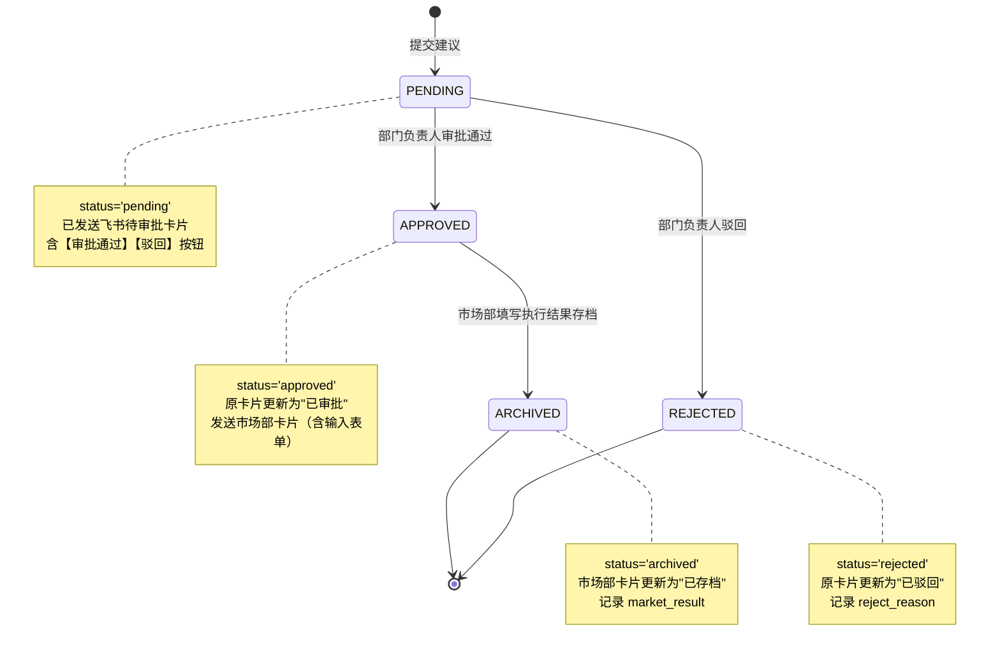
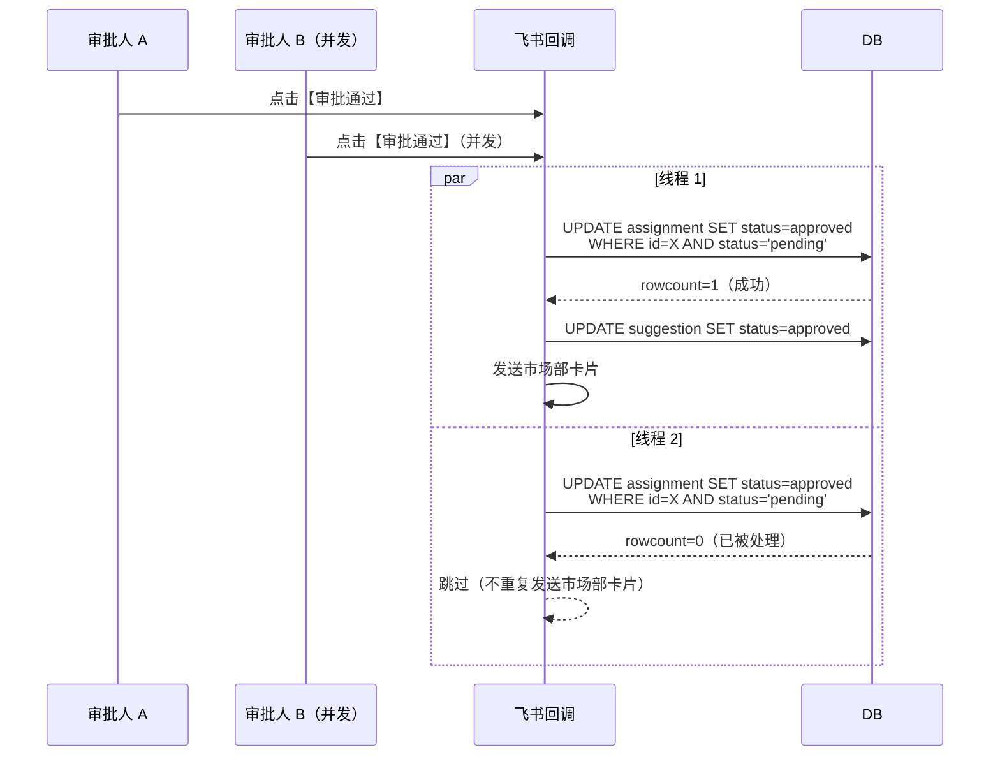
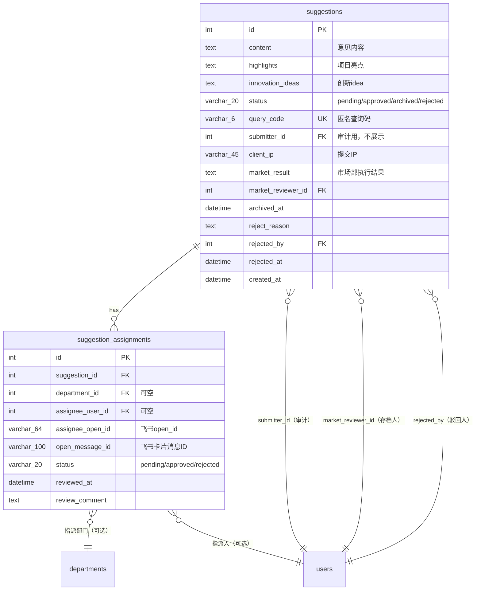
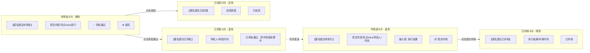

# 匿名建议业务逻辑流程图

## 概述

匿名建议模块支持员工匿名提交意见，通过飞书卡片流转至部门负责人审批、市场部存档，全流程对提交者隐藏身份（仅用 `submitter_id` 做审计、用 `query_code` 做进度查询）。

- **后端 API**: [backend/app/api/v1/suggestions.py](../backend/app/api/v1/suggestions.py)
- **业务服务**: [backend/app/services/suggestion_service.py](../backend/app/services/suggestion_service.py)
- **飞书回调**: [backend/app/integrations/feishu/callback_handler.py](../backend/app/integrations/feishu/callback_handler.py)
- **数据模型**: [backend/app/models/suggestion.py](../backend/app/models/suggestion.py)

## 状态机



## 完整业务流程

```mermaid
flowchart TD
    User([员工]) -->|提交建议| SubmitAPI[POST /api/v1/suggestions]

    subgraph SubmitStage [阶段 1: 提交建议]
        SubmitAPI --> Validate{校验<br/>department_id 或<br/>assignee_user_id}
        Validate -->|缺失| Err400[400: 请至少选择一个]
        Validate -->|通过| GenCode[生成 6 位查询码<br/>generate_query_code]

        GenCode -->|IntegrityError<br/>unique 冲突| RetryCode{重试 < 3 次?}
        RetryCode -->|是| GenCode
        RetryCode -->|否| Err500[500: 生成查询码失败]

        GenCode -->|成功| CreateSuggestion[创建 Suggestion<br/>status=pending]
        CreateSuggestion --> CollectRecipients[收集接收人]

        CollectRecipients --> HasDept{有 department_id?}
        HasDept -->|是| LoadDept[查询部门负责人<br/>校验 leader.feishu_open_id]
        LoadDept -->|无 open_id| Err400b[400: 部门未配置负责人]
        HasDept -->|否| HasUser{有 assignee_user_id?}

        LoadDept --> HasUser
        HasUser -->|是| LoadUser[查询指派人<br/>校验 feishu_open_id]
        LoadUser --> Dedup[去重 by open_id]
        HasUser -->|否| Dedup

        Dedup --> HasRecipients{有接收人?}
        HasRecipients -->|否| Err400c[400: 无可用接收人]
        HasRecipients -->|是| CreateAssignments[创建 SuggestionAssignment 记录]
        CreateAssignments --> CommitDB[提交 DB]
    end

    CommitDB --> BgTask[后台任务: _send_cards_task]
    BgTask --> SendCard[发送飞书待审批卡片<br/>send_pending_card<br/>3 次指数退避重试]
    SendCard --> UpdateMsgId[更新 assignment.open_message_id]
    UpdateMsgId --> ReturnCode[返回 query_code 给用户]

    User -->|凭 query_code 查询| TrackAPI[GET /suggestions/track/&#123;code&#125;]
    TrackAPI --> CheckOwner{校验 submitter_id<br/>== 当前用户?}
    CheckOwner -->|否| Err403[403: 无权查询]
    CheckOwner -->|是| ReturnStatus[返回状态/执行结果]

    SendCard -.->|飞书推送| Approver[部门负责人/指派人]

    subgraph ApproveStage [阶段 2: 审批通过 - 飞书卡片回调]
        Approver -->|点击【审批通过】| Callback1[飞书回调<br/>suggestion_approve_]
        Callback1 --> Thread1[启动线程 _handle_suggestion_approve]
        Thread1 --> UpdateAssign1[UPDATE assignment<br/>SET status=approved<br/>WHERE status=pending]
        UpdateAssign1 --> RowCount1{rowcount=1?}
        RowCount1 -->|否| Skip1[跳过 - 已被其他线程处理]
        RowCount1 -->|是| UpdateSugg1[UPDATE suggestion<br/>SET status=approved]
        UpdateSugg1 --> UpdateCard1[更新原卡片为"已审批"<br/>蓝色无按钮]
        UpdateCard1 --> SendMarketCard[发送市场部卡片<br/>含输入表单]
        SendMarketCard --> MarketTeam[市场部通知组成员]
    end

    subgraph RejectStage [阶段 2: 驳回 - 飞书卡片回调]
        Approver -->|点击【驳回】| Callback2[飞书回调<br/>suggestion_reject_]
        Callback2 --> Thread2[启动线程 _handle_suggestion_reject]
        Thread2 --> UpdateAssign2[UPDATE assignment<br/>SET status=rejected<br/>WHERE status=pending]
        UpdateAssign2 --> RowCount2{rowcount=1?}
        RowCount2 -->|否| Skip2[跳过 - 已被其他线程处理]
        RowCount2 -->|是| UpdateSugg2[UPDATE suggestion<br/>SET status=rejected<br/>reject_reason=审批人驳回]
        UpdateSugg2 --> UpdateCard2[更新原卡片为"已驳回"<br/>灰色无按钮]
    end

    subgraph ArchiveStage [阶段 3: 存档 - 飞书卡片回调]
        MarketTeam -->|填写执行结果<br/>点击【提交存档】| Callback3[飞书回调<br/>suggestion_archive_]
        Callback3 --> CheckResult{market_result 非空?}
        CheckResult -->|否| ErrToast[toast: 请填写执行结果]
        CheckResult -->|是| Truncate[I-24: 截断到 2000 字符]
        Truncate --> Thread3[启动线程 _handle_suggestion_archive]
        Thread3 --> UpdateSugg3[UPDATE suggestion<br/>SET status=archived<br/>market_result, archived_at<br/>WHERE status=approved]
        UpdateSugg3 --> RowCount3{rowcount=1?}
        RowCount3 -->|否| Skip3[跳过 - 已被其他线程处理]
        RowCount3 -->|是| UpdateCard3[更新市场部卡片为"已存档"<br/>绿色无按钮]
    end

    UpdateCard1 -.->|卡片状态变化| Approver
    UpdateCard2 -.->|卡片状态变化| Approver
    UpdateCard3 -.->|卡片状态变化| MarketTeam

    classDef apiCall fill:#e1f5ff,stroke:#0288d1
    classDef feishuCall fill:#fff4e1,stroke:#f57c00
    classDef dbOp fill:#e8f5e9,stroke:#388e3c
    classDef error fill:#ffebee,stroke:#c62828
    classDef success fill:#f3e5f5,stroke:#7b1fa2

    class SubmitAPI,TrackAPI apiCall
    class SendCard,UpdateCard1,UpdateCard2,UpdateCard3,SendMarketCard feishuCall
    class CreateSuggestion,CreateAssignments,CommitDB,UpdateAssign1,UpdateSugg1,UpdateAssign2,UpdateSugg2,UpdateSugg3 dbOp
    class Err400,Err400b,Err400c,Err500,Err403,ErrToast error
    class ReturnCode,ReturnStatus success
```

## 关键不变式与修复点

### 一致性（C-07/C-08: 并发幂等）



### 重试机制

| 场景 | 函数 | 重试策略 |
|---|---|---|
| query_code unique 冲突 | `submit_suggestion` 捕获 `IntegrityError` | 最多 3 次，每次重新生成 |
| query_code 生成查重 | `generate_query_code` | 30 次 + 50 次（仍 6 字符） |
| 飞书卡片发送 | `_send_with_retry` | 3 次指数退避（1s→2s→4s） |
| 飞书卡片更新 | `_update_card_with_retry` | 3 次指数退避（1s→2s→4s） |

## API 端点

| 方法 | 路径 | 权限 | 说明 |
|---|---|---|---|
| POST | `/api/v1/suggestions` | `suggestion:submit` | 提交匿名建议，返回 `query_code` |
| GET | `/api/v1/suggestions/track/{query_code}` | `suggestion:submit` | 凭查询码查询进度（校验归属） |
| GET | `/api/v1/suggestions/my-codes/list` | `suggestion:submit` | 获取当前用户历史查询码列表 |
| GET | `/api/v1/suggestions` | `suggestion:read` | 管理端建议列表（分页） |
| GET | `/api/v1/suggestions/{id}` | `suggestion:read` | 建议详情 |
| PUT | `/api/v1/suggestions/{id}/archive` | `suggestion:archive` | 市场部存档（API 路径，与飞书回调对称） |

## 数据模型



## 飞书卡片流转


